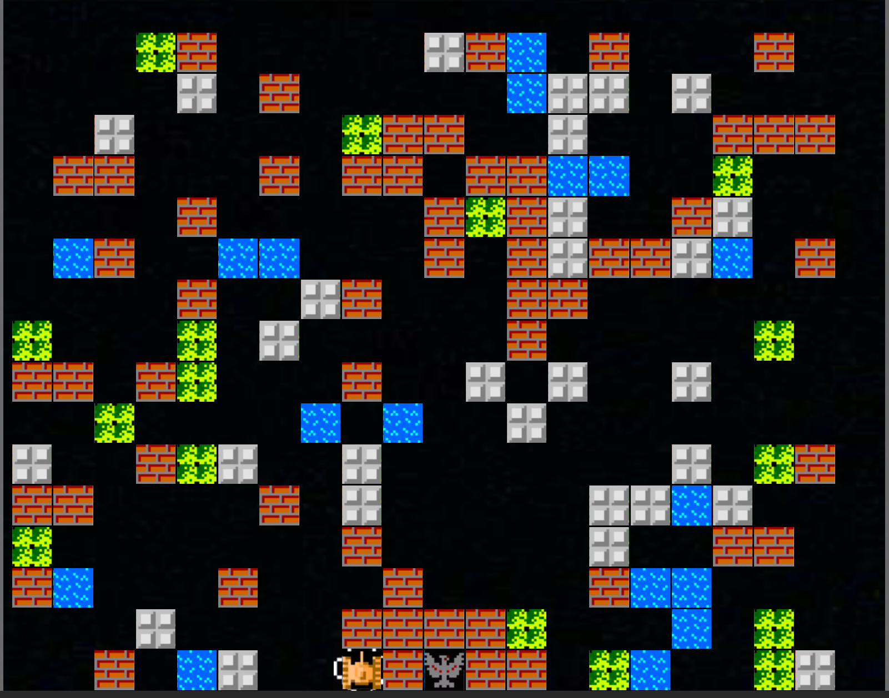
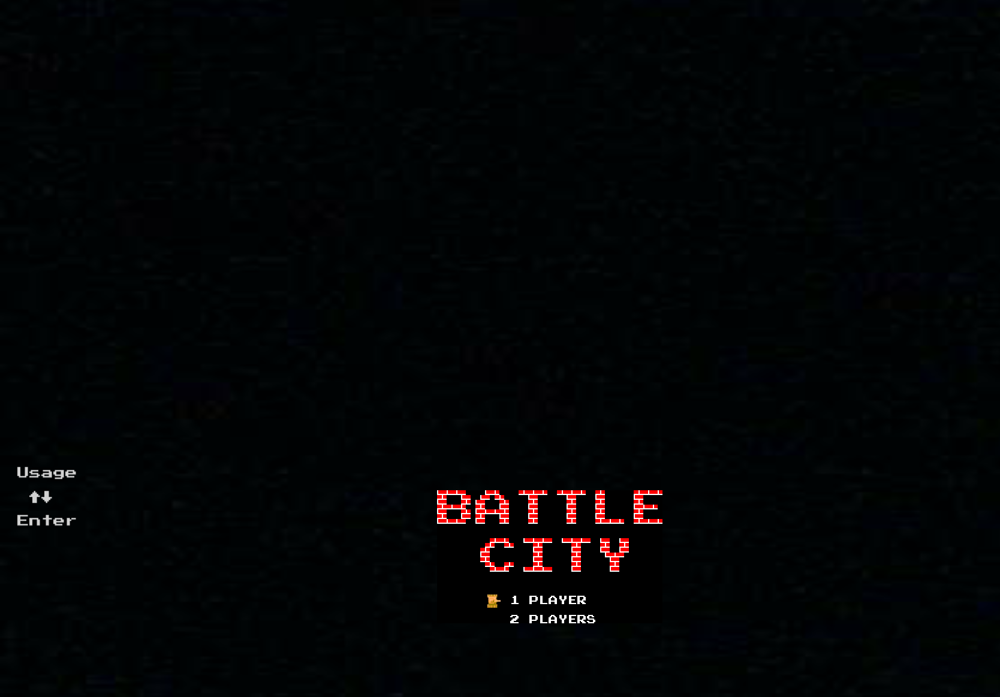

坦克大战小游戏
使用了公开的原版坦克大战素材
使用UGUI系统
支持双人模式
地图随机生成，敌人随时间增多，但是AI水平较低，进攻欲望不强，难度不高

## 1. 效果图

选择：
- `w` 或`↑` 向上
- `s` 或`↓` 向下
- `回车` 开始游戏

player1:    
- `w` 向上
- `s` 向下
- `a` 向左
- `d` 向右
- `j` 攻击

player2:    
- `↑` 向上
- `↓` 向下
- `←` 向左
- `→` 向右
- `回车` 攻击
